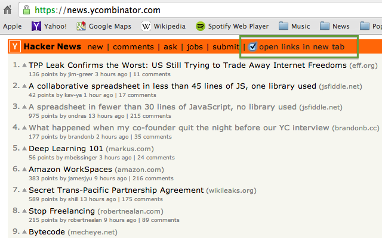

Hacker News - New Tab Links
===========================

A browser extension for [Google Chrome](https://chrome.google.com/webstore/detail/hacker-news-new-tab-links/oijenmnnifnjcohgoejolepdeefkldbl), [Firefox](https://addons.mozilla.org/en-US/firefox/addon/hacker-news-new-tab-links/), and [Opera](https://addons.opera.com/en/extensions/details/hacker-news-new-tab-links/) that lets you open external links on [Hacker News](https://news.ycombinator.com/) in a new tab by default.

A new option is placed into the navigation bar at the top of Hacker News and your setting is saved to localStorage, so your preference is remembered for the next time you visit the site.

If you're a reader of Hacker News give a try!

### Download Links ###
[Google Chrome](https://chrome.google.com/webstore/detail/hacker-news-new-tab-links/oijenmnnifnjcohgoejolepdeefkldbl)

[Firefox](https://addons.mozilla.org/en-US/firefox/addon/hacker-news-new-tab-links/)

[Opera](https://addons.opera.com/en/extensions/details/hacker-news-new-tab-links/)

Please feel free to [send me an email](mailto:github@joncordeiro.com) or [contact me on Twitter](https://twitter.com/joncordeiro) if you have any suggestions or feedback. Thanks!